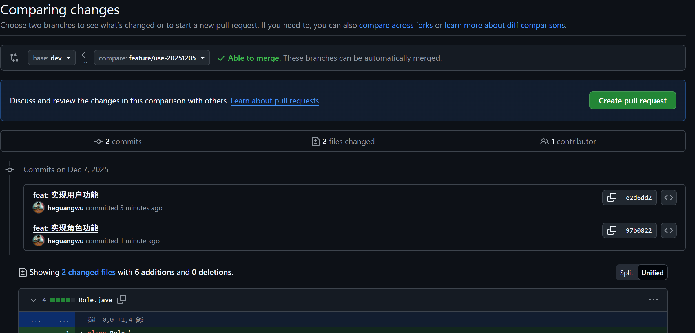
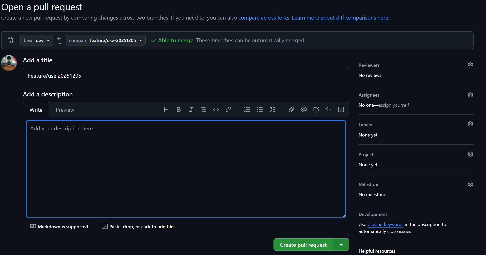
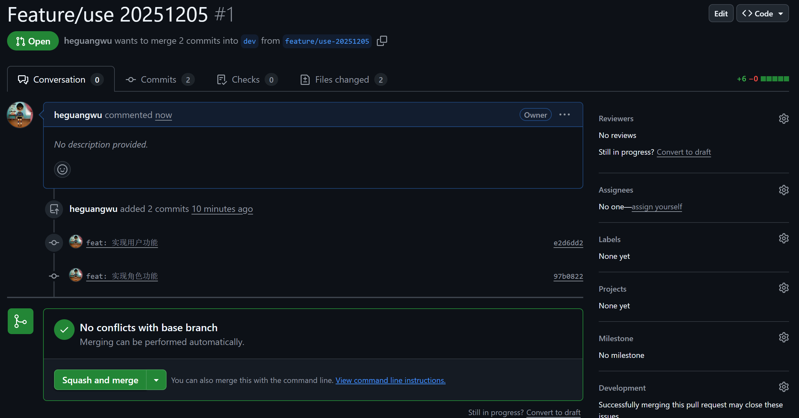
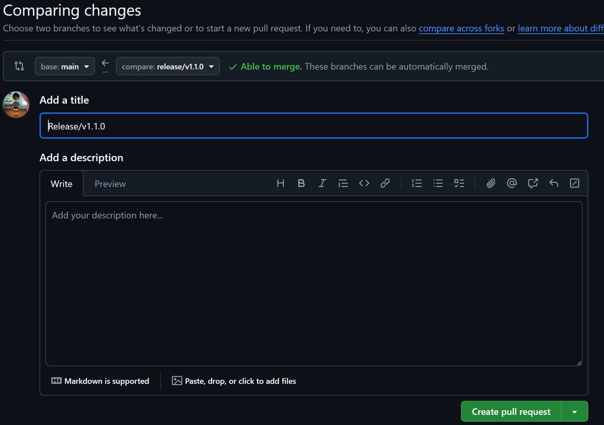

# `git` 工作流程

## 分支类型

- `main`(或`master`)分支发布的是生产环境代码，其仅接受`dev`分支或`hotfix`合并，不允许直接提交代码到该分支
  - 只有经过测试并且通过的代码才能合并到该分支
  - 每一次合并完成后必须给一个版本号，以`X.Y.Z`方式命名，如`3.2.19`
  - `X`为主版本，涉及较大版本升级，不同主版本之间不要求兼容
  - `Y`为次版本，涉及（向后兼容）功能增加，同一个主板吧不同次版本要求必须兼容
  - `Z`为补丁版本，仅用于修复 bug、优化性能、完善文档等操作，不新增任何功能
- `dev`分支为开发环境主分支，用于测试验证，不直接提交代码
  - 开发分支也可以进行版本控制，以`要发布的主版本号`加`alpha`、`beta`或 `rc`加`数字`命名，如如`3.2.19-rc.1`
- `feature`分支：特性开发分支
  - 从`dev`分支检出
  - 命名规则为`功能名称`+`日期`，如`user-login-20251201`
- `hotfix`分支：生成紧急修复分支
  - 从`master`分支检出，临时使用

## 特性开发流程

1. 从`dev`分支检出`feature`分支

```git
git checkout dev
git pull origin dev
git checkout -b feature/xxx-20251205
```

2. 开发完成后，推送到远程分支

```git
# 可以多次提交到feature分支
git add ${modify.file}
git commit -m "feat: 实现xxx功能"
git push origin feature/xxx-20251205
```

3. 创建发起PR(通过`github`操作)


4. 评审通过后，合并到`dev`分支(使用`Squash Merge`，避免)

5. 审批通过后可以删除`feature`分支

```git
# 切换到dev分支
git checkout dev
git pull origin dev

# 删除本地feature分支（可选）
git branch -D feature/use-20251205

# 删除远端feature分支
git push origin --delete feature/use-20251205
```

## 发布生成版本

1. 确保`dev`分支测试通过，从`dev`检出`release`分支用于最终验证

```git
git checkout dev
git pull origin dev
git checkout -b release/vx.y.z
```

2. 修复相关问题后，提交分支

```git
git add ${modify.file}
git push origin release/v1.1.0
```

3. 验证通过后，发起PR到`master`

```git
git checkout main
git pull origin main
git tag -a v1.1.0 -m "v1.1.0: 新增用户功能"
git push origin v1.1.0
```



4. 将`release`合并回`dev`后删除`release`分支（可选）

```git
git checkout dev
git pull origin dev
git merge --no-ff origin/release/v1.1.0 -m "merge: 同步release/v1.1.0"
git push origin dev

# 删除`release`分支（可选）
git branch -D release/v1.1.0
```
